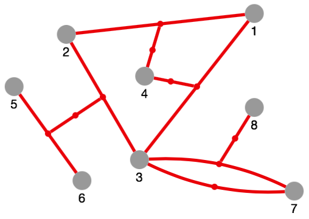
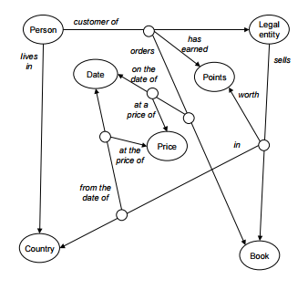
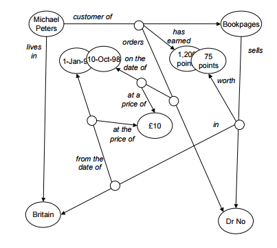

cytoscape-edge-connections
==========================





## Description

This Cytoscape extension allows edges to connect other edges, according to the Associative Model of Data
([demo](https://jri.github.io/cytoscape-edge-connections)).

This extension superimposes every edge with an auxiliary node, the "aux node". An aux node represents an edge and acts as a vehicle for connecting that edge.

Note: this extension does *not* emulate an edge by 2 edges with the aux node in the middle. Edges are not structurally changed. Instead the aux node is just superimposed, and the extension cares about keeping the aux node position in-sync with the edge position. This approach has several advantages:

1. The original graph structure is not changed; existing Cytoscape traversal algorithms continue to work.
2. Cytoscape's advanced edge rendering capabilities (e.g. curved parallel edges) continue to work.
3. Cytoscape's layout algorithms continue to work. Aux nodes are locked and do not participate in layout.

## The Associative Model of Data

Joseph V. Homan, Paul J. Kovacs -- A Comparison Of The Relational Database Model And The Associative Database Model (6 page article)  
*Issues in Information Systems*, Volume X, No. 1, 2009  
http://iacis.org/iis/2009/P2009_1301.pdf

Simon Williams -- The Associative Model Of Data (24 page article)  
*Journal of Database Marketing*, Volume 8, 4, 2001  
https://link.springer.com/content/pdf/10.1057/palgrave.jdm.3240049.pdf

Simon Williams -- The Associative Model Of Data (book, 284 pages)  
*Lazy Software*, 2nd edition, 2002  
http://www.sentences.com/docs/other_docs/AMD.pdf




## Dependencies

* Cytoscape.js ^3.2.0


## Usage instructions

Download the library:

* via npm: `npm install cytoscape-edge-connections`, or
* via direct download in the repository (probably from a tag).

Import the library as appropriate for your project:

**ES6** import:

```js
import cytoscape from 'cytoscape';
import edgeConnections from 'cytoscape-edge-connections';

cytoscape.use(edgeConnections);     // register extension
```

**CommonJS** require:

```js
let cytoscape = require('cytoscape');
let edgeConnections = require('cytoscape-edge-connections');

cytoscape.use(edgeConnections);     // register extension
```

**AMD** require:

```js
require(['cytoscape', 'cytoscape-edge-connections'], function (cytoscape, edgeConnections) {
  edgeConnections(cytoscape);       // register extension
});
```

**Plain HTML/JS** has the extension registered for you automatically, because no `require()` is needed.


## Initialization

You initialize the extension on the Cytoscape instance:

```js
const ec = cy.edgeConnections(config);
```

Optionally you can pass a config object.  
The possible config options are as follows:

| Config option  | Description                     | Default |
| -------------  | -----------                     | ------- |
| `maxPasses`    | See detail about *order* below. | `10`    |

## API

The object returned by `cy.edgeConnections()` has several functions available on it:

* `addEdge(edge)` adds the edge to the graph; `source` and `target` can refer to either a node or to *another edge*
* `addEdges(edges)` adds all edges contained in the given array to the graph
* `auxNode(edge)` returns the given edge's aux node; `undefined` if the given edge has no aux node;
   throws if the given object is not an edge
* `isAuxNode(node)` returns `true` if the given node is an aux node, `false` otherwise
* `edgeId(node)` returns the given aux node's edge ID (string); `undefined` if the given node is not an aux node;
   throws if the given object is not a node
* `edge(node)` returns the given aux node's edge; `undefined` if the edge is not in the graph (anymore);
   throws if the given object is not an aux node

The `addEdge(s)` method(s) accepts usual Cytoscape edge objects (plain JS objects) but with the specialty that `source` and `target` can refer to either a node or to *another edge*.

**Important:** in order to get edge connectivity you must create edges programmatically, that is by calling the `cy.addEdge(s)` method(s) listed above. Only then 1) the edge will get an aux node, and thus can be the source/target of another edge, and 2) can itself have an edge at their source/target end. In contrast edges created/added the standard way (either declaratively in the Cytoscape constructor or by calling `cy.add()`) will *not* get edge connectivity. Edges with and without aux node can friendly coexist in the same graph.

One more detail about *order*: the `cy.addEdges(edges)` method finds out itself the order in which to add the given edges. There is *no* requirement a referred edge appears in the `edges` array *before* the referring edge. The only requirements are 1) the referred edges are contained in the array *somewhere*, and 2) the referred *nodes* exist in the graph already. (The "find out order" process is governed by the `maxPasses` config value.) In contrast the (singular) `cy.addEdge(edge)` method requires that *both* referred elements (source and target) exist in the graph already, regardless of being node or edge.


## Styling

By default an aux node gets the same color as the edge it represents.

For further styling the `aux-node` class can be used, e.g. for setting the aux node size:

```js
cytoscape({
  style: [
    {
      selector: 'node.aux-node',
      style: {
        'width': 6,
        'height': 6
      }
    }
  ]
})
```


## Build

1. `npm install` : installs Webpack into `./node_modules`
2. `npm run build` : builds `./src` into `./dist/cytoscape-edge-connections.min.js`


## Version history

**0.3.0** -- Jan 14, 2019

* Improved aux node styling:
    * An aux node gets the same color as the edge it represents automatically
    * Aux nodes have class `aux-node`, for manual styling (`auxNodeData` config option is removed)
* API changes:
    * Support edges with string IDs as well
    * New method: `edge()` returns an aux node's edge
* Proper extension namespacing (thanks to @maxkfranz):
    * Initializer returns API object (don't clobber Cytoscape's core and collection API)
    * Internal: use a scratchpad to enrich edge data

**0.2.1** -- Jan 5, 2019

* README: add styling hint

**0.2** -- Jan 2, 2019

* Extension is general purpose (DMX application specifics removed)
    * 2 config options can be passed to initializer: `auxNodeData`, `maxPasses`
* Fix: aux nodes are not movable by user
* Extended README
* [Demo page](https://jri.github.io/cytoscape-edge-connections)

**0.1** -- Dec 30, 2018

* Initial version; functional
