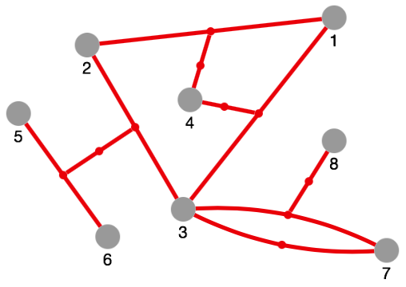

cytoscape-edge-connections
==========================





## Description

This Cytoscape extension allow edges to be connected to other edges, according to the Associative Model of Data
([demo](https://jri.github.io/cytoscape-edge-connections)).

This extension superimposes every edge with an auxiliary node, the "aux node". An aux node represents an edge and acts as a vehicle for connecting that edge.

Note: an edge is *not* represented as 2 edges with the aux node in between. Existing edges are not structurally changed. Instead the aux node is just superimposed, and the extension cares about keeping the aux node position in-sync with the edge position. This approach has several advantages:

1. The original graph structure is not changed, and existing traversal algorithms are not required to be adapted.
2. Cytoscape's advanced edge rendering capabilities (e.g. curved parallel edges) are leveraged.
3. Cytoscape's layout algorithms are leveraged. Aux nodes are locked and do not participate in layout.


## Dependencies

* Cytoscape.js ^3.2.0


## Usage instructions

Download the library:

* via npm: `npm install cytoscape-edge-connections`, or
* via direct download in the repository (probably from a tag).

Import the library as appropriate for your project:

**ES6** import:

```js
import cytoscape from 'cytoscape';
import edgeConnections from 'cytoscape-edge-connections';

cytoscape.use(edgeConnections);     // register extension
```

**CommonJS** require:

```js
let cytoscape = require('cytoscape');
let edgeConnections = require('cytoscape-edge-connections');

cytoscape.use(edgeConnections);     // register extension
```

**AMD**:

```js
require(['cytoscape', 'cytoscape-edge-connections'], function (cytoscape, edgeConnections) {
  edgeConnections(cytoscape);       // register extension
});
```

**Plain HTML/JS** has the extension registered for you automatically, because no `require()` is needed.


## Initialization

You initialize the extension on the Cytoscape instance:

```js
cy.edgeConnections(config);
```

Optionally you can pass a config object.  
The possible config options are as follows:

| Config option  | Description | Default |
| -------------  | ----------- | ------- |
| `auxNodeData`  | A function that receives an edge and returns a "data" object to be used when creating that edge's aux node. Use this option to enrich aux nodes by data, e.g. for styling. | `edge => ({})` |
| `maxPasses`    |             | `10`           |


## API

The extension adds 2 core and 3 collection methods:

* `cy.addEdge(edge)` adds the edge to the graph; `source` and `target` can refer to another edge
* `cy.addEdges(edges)` adds all the edges of an array to the graph
* `edge.auxNode()` returns the edge's aux node; `undefined` if the edge has no aux node
* `node.isAuxNode()` returns `true` if the node is an aux node, `false` otherwise
* `node.edgeId()` returns the aux node's edge ID; `undefined` if the node is not an aux node

The `addEdge(s)` method accepts usual Cytoscape edge objects (plain JS objects) but with the particularity that the `source` and `target` data can refer to another edge.

**Important:** in general use only the `addEdge(s)` method to add edges to the graph. Don't add edges declaratively (when calling the Cytoscape constructor) or by calling `cy.add()`. Only then your edges will get an aux node, and thus are ready for being connected to other edges.

You still can have edges without an aux node in your graph (by adding declaratively or by `cy.add()`).

## Build

1. `npm install` : installs Webpack into `./node_modules`
2. `npm run build` : builds `./src/**` into `./dist/cytoscape-edge-connections.min.js`


## Version history

**0.1** -- Dec 30, 2018

* Initial version; functional
